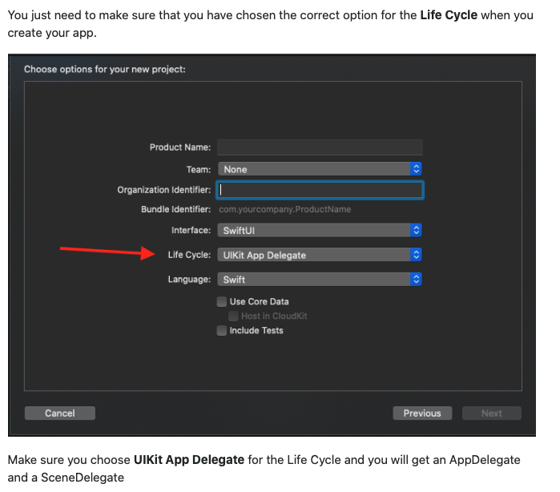
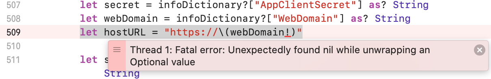
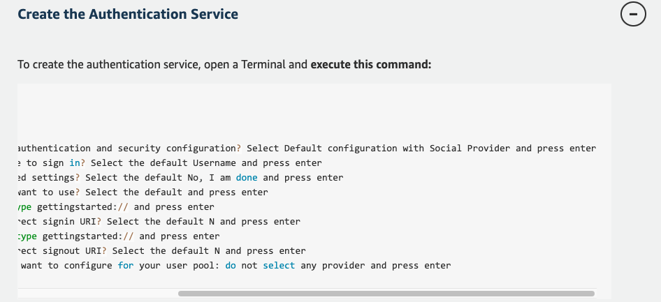
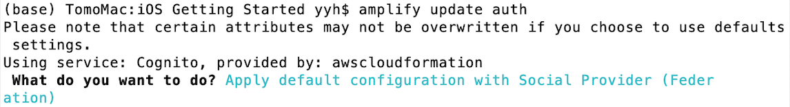
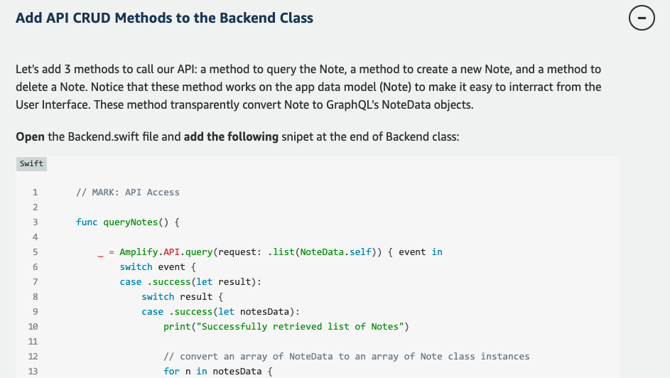
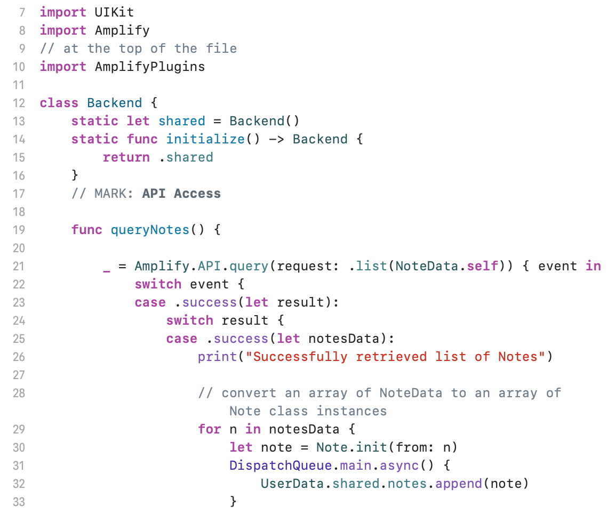
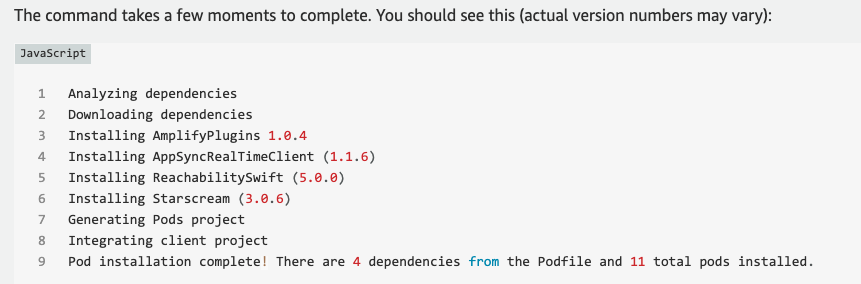

# AWS Front-End Developer Tutorial

[AWS Lauch Your First Application–Front-End Developer–Build an iOS Application](https://aws.amazon.com/getting-started/hands-on/build-ios-app-amplify/?e=gs2020&p=frontend&p=gsrc&c=lp_fed)

## Purpose

Encountered a few bugs while trying out the tutorial, and I want to document those bugs and solutions here. 

I only included files that I worked with or modified, since the other files and folders may contain some senstive account info.

For **amplifyconfiguration.json** and **awsconfiguration.json files**, I used *** to replace sensitive account info.

Note that **AppDelegate.swift**, **ContentView.swift**, **info.plist**, and **SceneDelegate.swift** are supposed to be in a "iOS Getting Started" folder.

I encountered errors from module 1, 3 and 4.

### Module 1: Create iOS APP

It was my first time creating an iOS APP in Xcode, so my set up was incorrect for the first time, and since the screenshot on the tutorial was different, I didn't realize the bug until I ran into the problem of having to add some codes in AppDelegate.swift in module 2.

AppDelegate.swift was missing due to my initial set up, so I couldn't proceed.

Found the solution from [stackoverflow](https://stackoverflow.com/questions/62538110/swiftui-app-life-cycle-ios14-where-to-put-appdelegate-code).

### Module 3: Add Authentication

I ran into an error when I was trying to run and build the app at the end of this model.

It turned out I selected the wrong option for question 1 after running `<amplify add auth>`. Instead of **Select Default configuration with Social Provider** (the second option), I chose **Select Default configuration** (the first option).

I missed the **with Social Provider** part, because I didn't scroll to the right to see all the text.

After searching online for solution, I read from a [github discussion](https://github.com/aws-amplify/amplify-ios/issues/1074) that mentioned about the amplifyconfiguration.json file and that webdomain and other info should be listed there.

So the issue I had encountered was due to the missing parts in the **amplifyconfiguration.json**, which could be updated using `<amplify update auth>`.

Once I updated my amplify auth using `<amplify update auth>`, then `<amplify push>` and `<pod install>` to update my pod set up. I could see my webdomain section in the amplifyconfiguration.json file .

### Module 4: Add API and Database

Ran into a small error when I was following the instruction for module 4, **Add API CRUD Methods to the Backend Class**. I was confused by the instruction "add the following snipet **at the end of the Backend class**".

I did that and got some errors (can't identity what's identified in this set of codes) from the following codes that were needed to add in the **Backend.swift** and **ContentView.swift** files.

It worked after I put it after in front after the `<return .share>` line.

Another interesting thing I noticed from this module and module 5 but didn't give me an error:

    - In **Add API Client Library to the Xcode Project**, I only got 10 pods installed instead of 11 message in my terminal, but that didn't cause me any error. The image below is the message screenshot from AWS instruction.
    
    
    
    - Also in module 5, for **Add Amplify Storage Libraries to the Xcode Project**, I got 11 pods installed instead of 12, but that also didn't cause me any error. 

